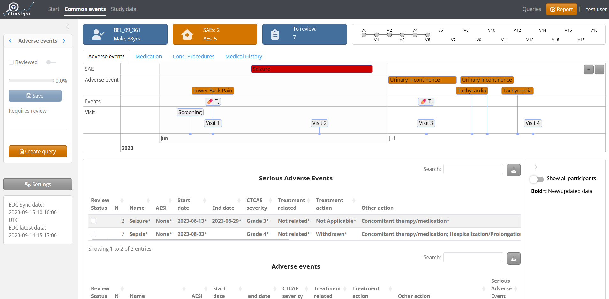
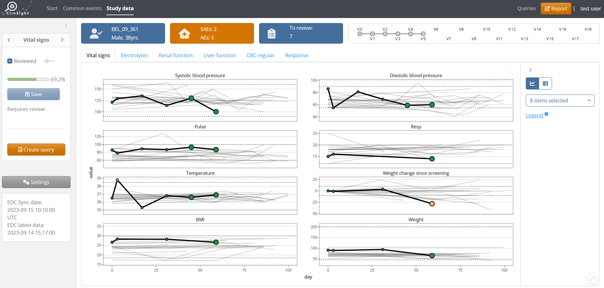
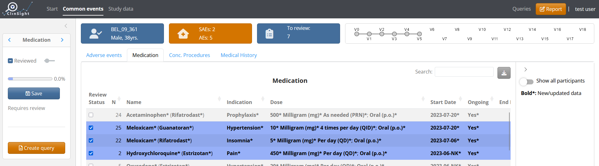
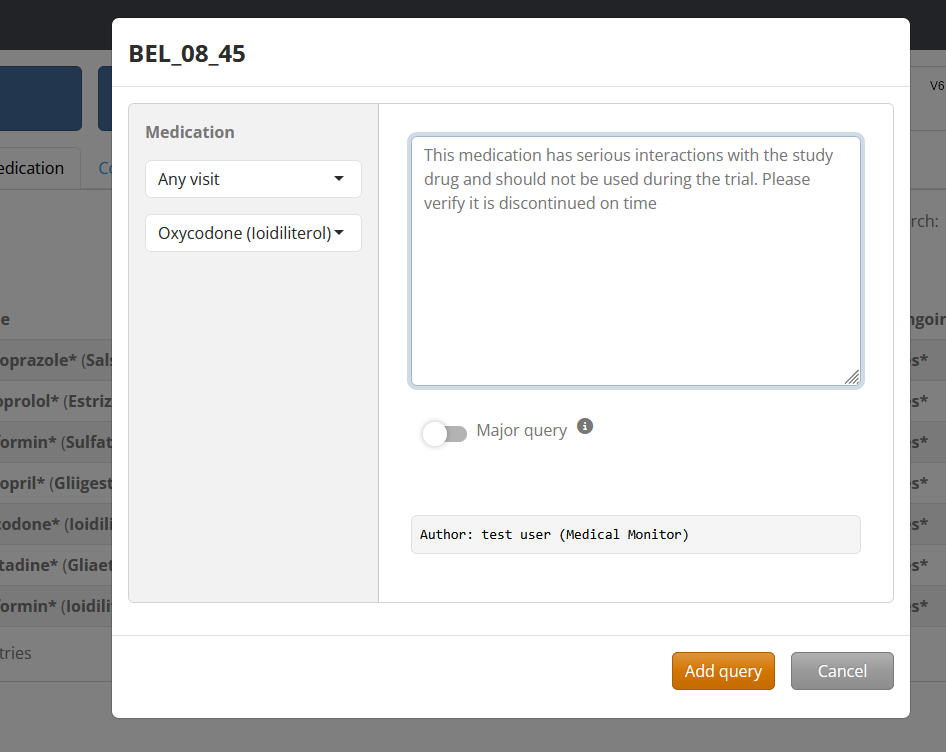
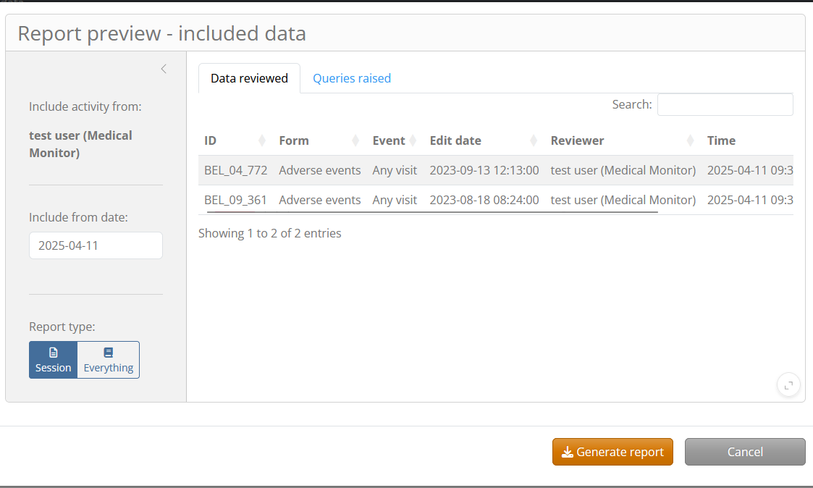

<!-- README.md is generated from README.Rmd. Please edit that file -->

# ClinSight 

<!-- badges: start -->

[](https://github.com/openpharma/clinsight/actions/workflows/R-CMD-check.yaml)
[](https://github.com/openpharma/clinsight/actions/workflows/test-coverage.yaml)
[](https://codecov.io/github/openpharma/clinsight)

<!-- badges: end -->

`ClinSight` provides a production-ready and easy-to-use application for
medically monitoring patient safety and data integrity throughout
clinical trials. The application provides a smart review platform and
interactive visualizations, creating an efficient patient overview that
usually cannot be achieved through native ‘Electronic Data Capture’
(EDC) interfaces.

## Primary Features

`ClinSight` contains an interactive timeline, relating clinical trial
procedures & treatments with adverse events that occur with a patient.



Patient data patterns over time can be easily visualized with
interactive figures, highlighting which data points are out of the
normal limits, and indicating whether a data point is newly
entered/changed in the EDC since the last review session.



Data can be marked as “reviewed” by row or by the entire form that is
active:



The application integrates an optional “query system”, in which medical
monitors can submit and track queries raised with the study site.



Detailed PDF reports can be generated that document a review session for
audit purposes:



## Installation

There are several ways to install `ClinSight`. To run the application
with the R environment as intended by the developers, you can git clone
the package repository, then open the project (`clinsight.Rproj`) and
restore the project’s environment with:

``` r
renv::restore()
```

This will install all the required packages with their intended
versions. Below, `renv::lockfile_read()$R` shows the R version and
libraries used at the time this README file was rendered. It is
recommended launch the project using the same R version, otherwise
errors might occur during installation.

``` r
renv::lockfile_read()$R
#> $Version
#> [1] "4.4.1"
#> 
#> $Repositories
#> $Repositories$RSPM
#> [1] "https://packagemanager.posit.co/cran/2024-09-17"
#> 
#> $Repositories$RSPM2
#> [1] "https://packagemanager.posit.co/cran/2025-04-01"
```

Another option for installing clinsight is simply directly installing
the latest stable version from [GitHub](https://github.com/) with:

``` r
# install.packages("pak")
pak::pkg_install("openpharma/clinsight")
```

The development version with the latest features and updates can be
installed by pointing to the `dev` branch during installation:

``` r
pak::pkg_install("openpharma/clinsight@dev")
```

After installation, the application can be tested with internal data
using the function `test_clinsight()`.

``` r
library(clinsight)
# Not run:
test_clinsight()
```

## Learn more

The application is easily customized to any study using a metadata file
(see `vignette('Metadata')`), that configures how the data will be
presented in the application. For more information on how to fully set
up `ClinSight` with your organization’s data, see
`vignette('clinsight')`.
