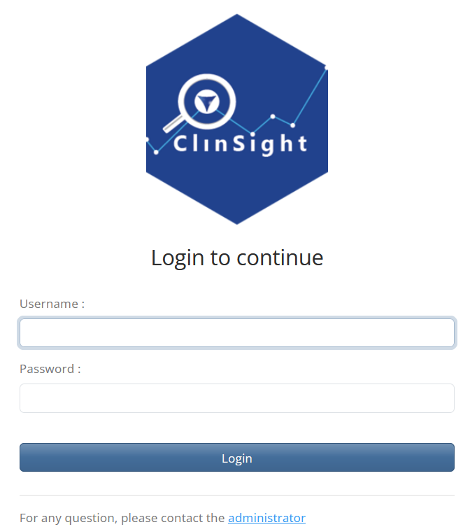
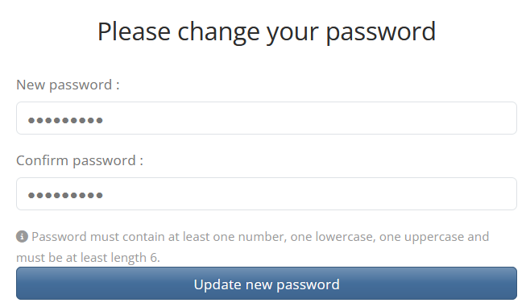
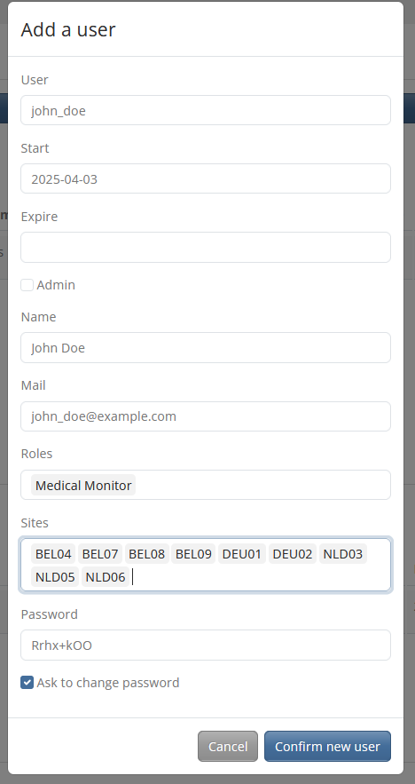

```{r, include = FALSE}
knitr::opts_chunk$set(
  collapse = TRUE,
  comment = "#>"
)
```

```{r setup, echo = FALSE}
library(clinsight)
```

ClinSight can be customized using two different configuration files. [General configuration](#general-config) is stored in a configuration `.yml` file, while [study-specific configurations](#study-specific-config) is stored in a metadata Excel file. Both will be discussed in this vignette.

## Study-specific configuration {#study-specific-config}

## metadata

Metadata file explanation will follow here.

## General configuration {#general-config}

The general ClinSight configuration is set using a `golem-config.yml` file. This file mostly contains settings that do not frequently change between studies within an organization, such as organization-specific deployment options. The current configuration file is shown below and will be discussed in detail.

```{r echo = FALSE, results ='markup', comment=""}
cat(readLines(system.file("golem-config.yml", package = "clinsight")), sep = "\n")
```

### Setting configurations

There are multiple configuration settings built in ClinSight, of which the most important ones are: `default`, `shinymanager`, `shinyproxy`, and `posit_connect`. Other available settings such as `dev` and `test` are only meant for testing purposes and should not be used.

A configuration can be set by changing the GOLEM_CONFIG_ACTIVE environment variable, for example like this:

`Sys.setenv("GOLEM_CONFIG_ACTIVE" = "shinymanager")`

With the standard ('default') settings, internal example data with matching metadata will be used when running ClinSight. There are the settings used when running \`clinsight::run_app()\` after a fresh installation. A user database named `user_db.sqlite` will be created in the current working directory if it does not yet exist. This database stores user data such as which data points are reviewed, and which queries are raised.

The default settings are useful for demonstration purposes, but different settings are needed when using ClinSight with clinical trial data. Currently, there are three ways to run and/or deploy ClinSight, which are mentioned below.

### Shinymanager

One way of deployment is using `shinymanager`. `Shinymanager` is a flexible way to provide user authentication for clinsight. This provide a fast deployment option, since everything can be run on a local machine, while still providing multiple options for user and password management by using a local `credentials.sqlite` database.

To use `shinymanager`, first make sure that the `shinymanager` package is installed, then set the configuration accordingly with `Sys.setenv("GOLEM_CONFIG_ACTIVE" = "shinymanager")` and run the application with `clinsight::run_app()`. However, this configuration will not work out of the box, since it expects a `study_data.rds` file and a `metadata.rds` file to be present in the current working directory. With a few lines of code, it is possible to test this setup with \`clinsight\` package data in a temporary folder:

```{r shinymanager-example}
# Not run:
if (interactive()){
  Sys.setenv("GOLEM_CONFIG_ACTIVE" = "shinymanager")
  temp_folder <- tempfile(tmpdir = tempdir())
  dir.create(temp_folder)
  saveRDS(clinsightful_data, file.path(temp_folder, "study_data.rds"))
  saveRDS(metadata, file.path(temp_folder, "metadata.rds"))
  run_app(
    data_folder = temp_folder,
    credentials_pwd = "CHANGE_ME",
    onStart = \(){onStop(\(){
      unlink(temp_folder, recursive = TRUE); 
    })}
  )
}
```

This code will create a `user_db.sqlite` file and a `credentials.sqlite` file in either the working directory or in the `data_folder`, if this argument is specified, as is the case in this example. Note that the credentials.sqlite database is protected for unauthorized access with the password provided in the argument \`credentials_pwd\` (currently set to "CHANGE_ME"). If the code above is run, a login page will be shown.

{width="349"}

For the first login, the \`credentials.sqlite\` database is newly created and the login name will be 'admin', and the password will be \`1234\`. After first login, a password change and a login with the new password is required before the ClinSight app can be accessed.

{width="336"}

After successful login, new users can be added by going to the Administrator panel:


When creating a new user, make sure that the User field does not contain spaces and that the expiration date and the sites that the user needs to access are entered/selected correctly.

{width="385"}

More details can be found in the documentation of the `shinymanager` package.

### Shinyproxy

Another way of deployment can be with the use of \`shinyproxy\`.

### Posit Connect

There

### Customizing configuration

If the profiles above are insufficient, you can also provide your own configuration file with fully customized settings with the steps described below.

To do so, first create a configuration template. The function [create_clinsight_config()] can be used to create a copy of the current `clinsight` configuration file in the current working directory. To use this configuration file with `clinsight`, the environment variable named "CONFIG_PATH" needs to be set by using a command similar to the following: \`Sys.setenv("CONFIG_PATH" = "PATH_TO_CONFIG/clinsight_config.yml")\`, where `PATH_TO_CONFIG` is the path to the folder in which the configuration file is located.
