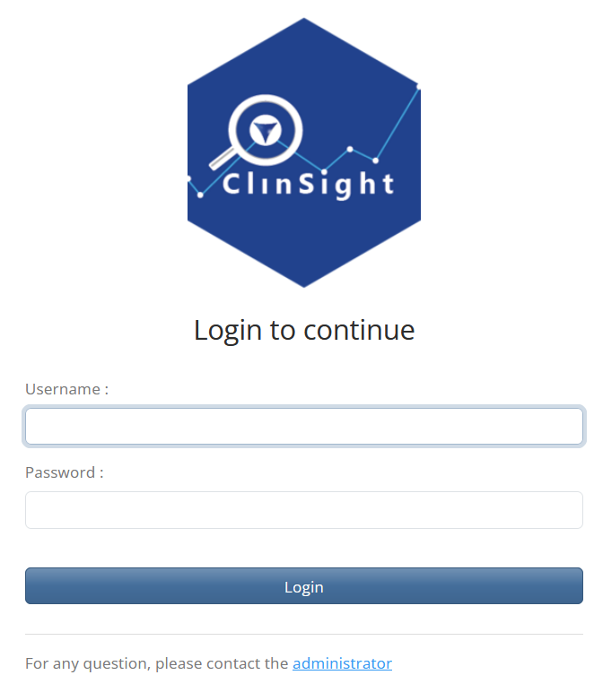
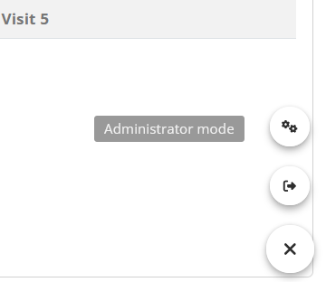
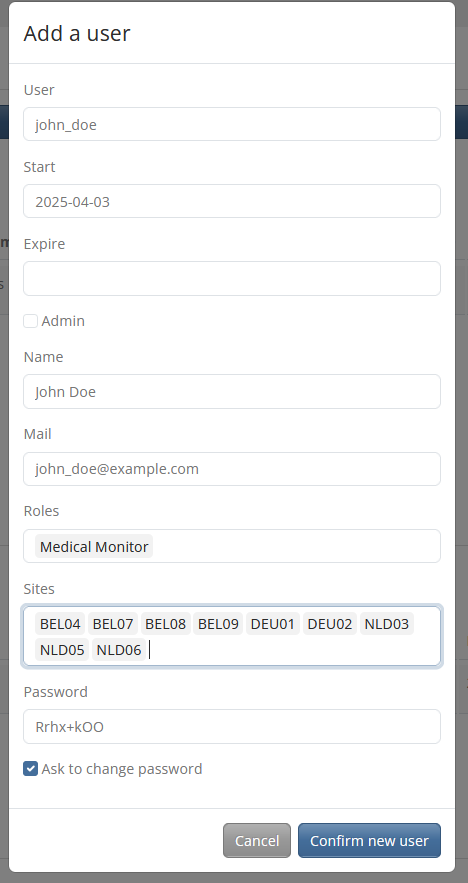

```{r, include = FALSE}
knitr::opts_chunk$set(
  collapse = TRUE,
  comment = "#>"
)
```

```{r setup, echo = FALSE}
library(clinsight)
```

ClinSight can be customized using two different files.
Study-specific configurations are stored in a metadata file that can be created with a [metadata Excel template](./Metadata.html), while [general configuration](#general-config) is stored in a configuration `.yml` file.
The latter contains settings more related to deployment, and will be discussed here.

## General configuration {#general-config}

The general ClinSight configuration is set using a `golem-config.yml` file.
This file mostly contains settings that do not frequently change between studies within an organization, such as organization-specific deployment options.
A configuration file (the default at the time this vignette was rendered) is shown below and will be discussed in detail.

```{r echo = FALSE, results ='markup', comment=""}
cat(readLines(system.file("golem-config.yml", package = "clinsight")), sep = "\n")
```

### Config.yml arguments

The following are the most important arguments in the `golem-config.yml` file for `clinsight`:

-   `app_prod`: Controls a few production-related settings, such as whether a warning is shown if the study data is older than one day (and thus possibly outdated), or whether the internal user database is always synchronized when starting ClinSight. It is recommended to set this to `TRUE` when the application is run in production.
-   `user_identification`: The way a user can be identified. For testing purposes, it can be set to `test_user`. In production, this can be set to either `shinymanager` (for [Shinymanager](#shinymanager-conf) deployments), `http_headers` (for [ShinyProxy](#shinyproxy-conf) deployments), or `shiny_session` (for [Posit Connect](#posit_connect-conf) deployments).
-   `study_data`: In the default settings, this path will directly return the internal package data for testing purposes. In production, this argument should contain the file path to the study's raw data, prepared in an `.rds` file.
-   `meta_data`: In the default settings, this path will return example metadata for testing purposes. In production, this argument should contain the file path to the metadata, prepared as an `.rds` file.
-   `user_db`: Path to the user database SQLite file. If it doesn't already exist, a new database will be automatically generated in this file location.
-   `credentials_db`: Path to the credentials database (a .sqlite file). Only applicable in the `shinymanager` configuration.
-   `user_roles`: List with roles (in this format: `Role Name: role_id`) that are available in the application.
-   `allow_to_review`: List of role names (specified above) which are allowed to review data in the application.
-   `allow_listing_download`: Logical, `TRUE` if users are permitted to download listings from the ClinSight application directly to Excel for sharing (or other uses).
-   `allow_query_inputs`: Logical, \`TRUE\` to permit users to submit and track queries within the application's database.

### Setting configurations

A configuration can be set by changing the GOLEM_CONFIG_ACTIVE environment variable before calling `run_app()`, for example like this:

`Sys.setenv("GOLEM_CONFIG_ACTIVE" = "shinymanager")`

There are multiple configurations pre-built in ClinSight's `golem-config.yml`, of which the most important ones are: `default`, `test`, `shinymanager`, `shinyproxy`, and `posit_connect`.
The first two are meant for testing purposes, while the other settings are more suited for use in production.

With the standard ('default') configuration, the package's internal "example data" with matching metadata will be used to run `ClinSight`.
These are the settings used when running `clinsight::run_app()` after a fresh installation.
A user database named `user_db.sqlite` will be created in the current working directory if it does not yet exist.
This database stores user data such as which records are reviewed, and which queries are raised (if any).

The default settings are useful for demonstration purposes, but different settings are required when using `ClinSight` with actual clinical trial data.
Currently, there are three ways to run and/or deploy `ClinSight`, which are mentioned below.

### Run application

For testing ClinSight, the function `test_clinsight()` was [introduced previously](#./clinsight.html).
This function is a thin wrapper around `run_app()` that ensures the required databases are created and destroyed with app launch & exit.
This makes it easier to prototype the application, and tweak the data/metadata for use with ClinSight.

For deploying ClinSight, however, the function `clinsight::run_app()` should be used directly.
This function creates databases in the working directory that will save user actions such as review status of study data.
Depending on the configuration settings chosen, a credentials database will be created (for deployments using `shinymanager`) In addition, a path to the study data and metadata (both `.rds` files) can be provided in the configuration file.

### Shinymanager {#shinymanager-conf}

One way of deployment is using [shinymanager](https://datastorm-open.github.io/shinymanager/).
The `shinymanager` package provides a user authentication and user management layer and its use is preconfigured for `clinsight`.
It provides a fast way of deployment, particularly suited for quick local deployment.
User and password management information is stored within a local encrypted `credentials.sqlite` database.
This provides a brief overview of how shinymanager can be used with ClinSight.
For more details, please visit the [shinymanager website](https://datastorm-open.github.io/shinymanager/).

To use `shinymanager` with ClinSight, first make sure that the `shinymanager` package is installed, then set the configuration accordingly with `Sys.setenv("GOLEM_CONFIG_ACTIVE" = "shinymanager")`.
This configuration expects the files `study_data.rds` and `metadata.rds` to be present in the current working directory.
Finally, a credentials password needs to be provided in the `run_app()` command; this is used to encrypt/decrypt the database.

```{r shinymanager-example}
# Not run:
# Example setup for deployment. Warning: this will create multiple files in the current working directory.
if (interactive()){ 
  saveRDS(clinsightful_data, "study_data.rds")
  saveRDS(metadata, "metadata.rds")
  Sys.setenv("GOLEM_CONFIG_ACTIVE" = "shinymanager")
  run_app(credentials_pwd = "TEMP_PASSWORD")
}
```

This code will first save the internal package data in the working directory, and then create a `user_db.sqlite` file and a `credentials.sqlite` file in the same directory.

For testing purposes, the `shinymanager` configuration can be tested out using `test_clinsight()` and with internal package data:

```{r}
if (interactive()){ 
  test_clinsight(clinsight_config = "shinymanager")
}
```

Note that the `credentials.sqlite` database is protected for unauthorized access with the password provided in the argument `credentials_pwd` (currently set to "TEMP_PASSWORD").
If the code above is run, a login page will be shown.

{width="349"}

For the first login, the `credentials.sqlite` database is newly created.
In this case, the login name will be 'admin' and the password `1234`.
After first login, a password change and a login with the new password is required before the ClinSight app can be accessed.

{width="336"}

After successful login, new users can be added by going to the Administrator panel using the widget in the bottom right of the screen:



When creating a new user, make sure that the User field does not contain spaces and that the expiration date and the sites that the user needs to access are entered/selected correctly.

{width="385"}

More details can be found in the documentation of the [shinymanager](https://datastorm-open.github.io/shinymanager/) package.

### Shinyproxy {#shinyproxy-conf}

Another way of deployment can be with the use of [shinyproxy](https://shinyproxy.io/).
`ShinyProxy` is fully open source software and provides multiple options for deploying shiny applications, with built-in support for the latest authentication and authorization technologies such as [OpenID Connect](https://openid.net/developers/how-connect-works/).
It serves shiny (or other data science) applications in Docker containers.
This provides multiple advantages, among which the possibility to run applications fully isolated, and to deploy multiple versions of an application without any problems.
This guide provides some brief hints to get started with a `ShinyProxy` deployment.

First download and install `ShinyProxy` according to the instructions on the [ShinyProxy website](https://shinyproxy.io/).
Second step is to store ClinSight in a Docker image.
A good place to start are the images from the [Rocker Project](https://rocker-project.org/), which can be fairly quick to setup.
Alternatively, smaller Docker images with less dependencies can be created with [Alpine Linux images](https://hub.docker.com/_/alpine).
This will probably take longer to set up, since Rstudio Package Manager provides no binaries for Alpine Linux at the time of writing, meaning that all R packages need to be installed from source.

Within the Docker file, install `clinsight`, create a folder named `study_data` in the current user's home directory.
Then set the configuration to `shinyproxy` and create a CMD line similar to below:

```{docker, eval=FALSE}
ENV GOLEM_CONFIG_ACTIVE="shinyproxy"
CMD R -e "options('shiny.port'=3838, shiny.host='0.0.0.0', golem.app.prod = TRUE); clinsight::run_app()"
```

Then, ensure that the shinyproxy configuration .yml file is setup correctly.
Below is an example to get started.
Note that these settings assume that openID Connect is used for authentication.
Configuring this properly is outside of the scope of this guide; see the [shinyproxy](https://shinyproxy.io/) documentation for details on this.

```{yaml}
proxy:
  title: "ClinSight Portal"
  port: 8080
  authentication: openid
  container-wait-time: 60000
  openid:
    auth-url: ...
    jwks-url: ...
    token-url: ...
    client-id: ...
    client-secret: ...
    username-attribute: email
    roles-claim: roles
  docker:
    internal-networking: true
  admin-groups: admin
  specs:
  - id: clinsight
    container-image: clinsight_image:latest
    container-volumes: ["LOCAL_DATA_FOLDER/study_data:/home/clinsight_user/study_data"]
    container-network: internal_network
    http-headers:
      X_SP_USERNAME: "#{T(java.util.Base64).getEncoder().encodeToString(oidcUser.getFullName().getBytes())}"
```

A few more important notes:

\- A data volume needs to be mounted to the docker container in order for the application to run correctly.
The Docker container user also needs writing access to this folder.

\- User names are passed through using HTTP headers.
Since HTTP headers cannot handle all UTF-8 characters, the user names need to be base64 encoded as shown in the example `.yml` file.

### Posit Connect {#posit_connect-conf}

Lastly, ClinSight provides a configuration to deploy applications with Posit Connect.

To use it, set the active configuration to `posit_connect`:`Sys.setenv("GOLEM_CONFIG_ACTIVE" = "posit_connect")`.
This configuration utilizes Shiny `session` objects to manage user credentials.
The `user_role` element of `config.yml` will correspond to `session$groups` so that users can be assigned review status by group assignment within Connect.
The `session` object `session$user` will be utilized to log user interactions in the application as well.

For ease of deployment, a `manifest.json` file has been included in the root directory.
This manifest includes packages not included in the `minimal` profile needed for deployment using the `app.R` file.

### Customizing configuration

If the profiles above are insufficient, you can also provide your own configuration file with fully customized settings with the steps described below.

To do so, first create a configuration template.
The function `create_clinsight_config()` can be used to create a copy of the current `clinsight` configuration file in the current working directory.
To use this configuration file with `clinsight`, the environment variable named "CONFIG_PATH" needs to be set by using a command similar to the following: `Sys.setenv("CONFIG_PATH" = "PATH_TO_CONFIG/clinsight_config.yml")`, where `PATH_TO_CONFIG` is the path to the folder in which the configuration file is located.
