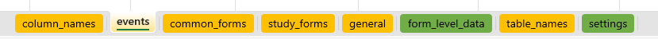
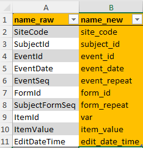
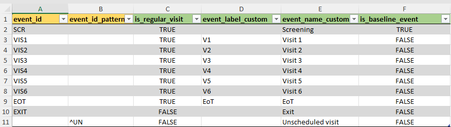
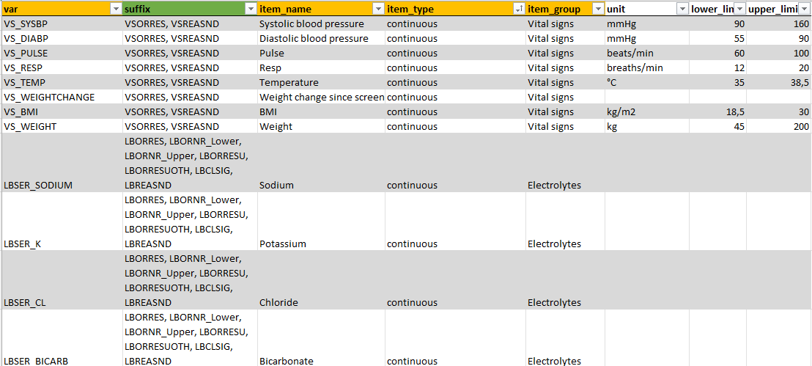
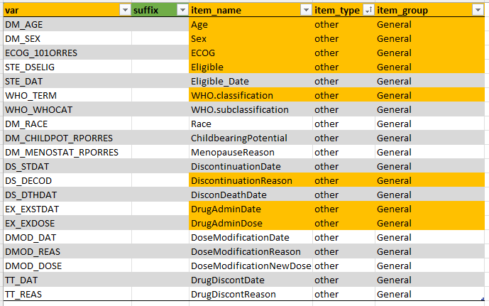
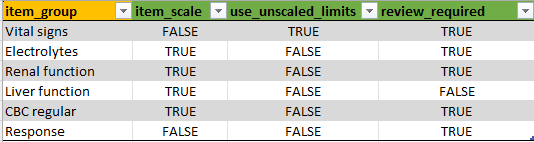
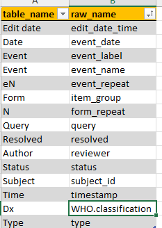

```{r, include = FALSE}
knitr::opts_chunk$set(
  collapse = TRUE,
  comment = "#>"
)
```

```{r setup, echo = FALSE}
library(clinsight)
```

A metadata file needs to be customized and created for each study. Use the function `create_clinsight_metadata()` to create and open a new template. The Excel template contains multiple tabs which are described below in detail. The orange tabs are mandatory and should not be removed or renamed.

{width="587" height="35"}

#### column_names

Within the first tab, the column names of the raw data need to be specified. The columns with the names within `name_raw` will be renamed to the new name when merging metadata with raw data later. Again, orange fields should not be adjusted.



#### events

Next tab contains information about study events.



All study visits should be entered in the `event_id` column, in order to preserve the correct order of events.

The green-colored column names are optional columns. `is_regular_visit` can be used to mark a specific visit as non-regular/ not planned. Unplanned visits will not show up in the compact timeline and will not be used to increment an internal visit counter for each patient.

If needed, the name of the `event_id` can be customized using two columns. `event_label_custom` changes the event label within the compact timeline in the top right corner of the application. `event_name_custom` will change the standard `event_id` label anywhere else in the application.

Lastly, ClinSight needs to know which is the baseline event to create internal counters of how many days are passed since baseline. It assumes that the first visit in the list (which is `SCR` in the example) is the baseline visit, but this can be changed using the `is_baseline_event` column. Note that only one event can be set as baseline here.

If the number of events cannot be specified correctly beforehand, a user can also provide an `event_id_pattern` matching to create event labels and event names.

#### common_forms

This tab contains information about the variables that need to be displayed in the `Common events` tab in `ClinSight`. Together with `study_forms` and `general`, this tab contains most of the data that will be shown in the app.

The column `var` contains the exact name of the variable in the raw data. The `item_name` column contains the name of the variable that will appear in the application. For common forms, there are some prefixes that will be stripped from the `item_name` so that a unique name for each variable can be provided: (`AE` for `Adverse Events` `CM` for (Concomitant) `Medication`, and `MH` for `Medical History`). The `item_group` column contains name of the form in which the item will show up in the application. Lastly, `item_type` can either be continuous or other, and it controls whether visualization or only tables will be displayed. This should usually be set to `other` within study_forms. More information on the other implemented options follows in the description for the `study_forms` below.

{width="633"}

Note that some of the `item_name`s are colored orange, meaning that ClinSight expect these names to be present. Currently it is not recommended to change these names. If they are missing in your own data, just leave them in the metadata as is. It will be made easier to customize these names and variables in a future update.

#### study_forms {#metadata-study_forms}

This tab contains information about the variables in the `Study data` tab in ClinSight. Mandatory columns are here `var`, `item_name`, `item_type`, and `item_group`.



Data and forms/item_groups entered in the `study_forms` tab will either show up in table form or, if all variables within an `item_group` are of `item_type` 'continuous', in interactive graphs. If all data is 'continuous', units and limits can be provided directly if these do not change within each site.

#### Scale continuous values

If limits are provided in the data, and especially if they can vary per study site, then there is an option within ClinSight to scale the values for each variable to a value between 0 and 1, with 0 being the lower limit and 1 being the upper limit of the normal range, based on the normal ranges of the local laboratory. This way, the values of a patient can be compared with all available data, even if other data was provided with other laboratory data and units. The formula used for scaling is shown below:

$$x_{scaled} = \frac{x-x_{lower}}{x_{upper}-x_{lower}}$$ *(*$x^{lower}$ is the lower limit of x and $x^{upper}$ the upper limit, according to the site-specific laboratory ranges).

In order to use this functionality, first the value `item_scale` in the tab [form_level_data](#form_level_data) should be set to `TRUE` and `use_unscaled_limits` to `FALSE`, so that it is clear for the application that values need to be scaled.

Then, additional data per variable needs to be provided. As an example, we will highlight the settings for the 'Sodium' variable in the package data. Multiple variables and values should be provided, with a consistent base name that identifies that variable in question (in this case `LBSER_SODIUM`, which corresponds to the `Sodium` `item_name`, and a varying `suffix`. For `Sodium`, the following variables can or will be used by ClinSight and should be available in the data in a long format, in the `var` column:

-   `LBSER_SODIUM_LBORRES`: The actual (raw) value belonging to this variable.
-   `LBSER_SODIUM_LBORNR_Lower`: The lower limit of the normal range.
-   `LBSER_SODIUM_LBORNR_Upper`: The upper limit of the normal range.
-   `LBSER_SODIUM_LBORRESU`: The unit belonging to the variable
-   `LBSER_SODIUM_LBORRESUOTH`: (Optional): If no standard unit is provided, but the site enters the unit manually, in some EDCs this input is in a separate row in the data. If provided here, this value will be used as unit if unit information in `LBSER_SODIUM_LBORRESU` is missing.
-   `LBSER_SODIUM_LBCLSIG`: (Optional): Whether the value was flagged as clinically significant (CS) or not clinically significant (NCS).
-   `LBSER_SODIUM_LBREASND`: (Optional): reason provided by the site why a variable was not measured.

To keep the metadata compact, the variables can also be provided by only stating the base name `LBSER_SODIUM` in the `var` column, and specifying the suffixes in the `suffix` column (see screenshot above). `ClinSight` will automatically expand the base name with all suffixes provided when reading metadata with `get_metadata()`.

> *Important note: while the base name is flexible and can be anything, currently it is easiest to keep the suffixes as stated above, since that is the format that ClinSight expects: `LBORRES`, `LBORNR_Lower`, `LBORNR_Upper`, `LBORRESU`, `LBORRESUOTH`, `LBCLSIG`, and `LBREASND`. If the `suffix` names differ in the raw data, you can provide the actual names in the metadata tab, and then provide a custom function in the `settings` tab (see below) which renames the variables to the ones mentioned.*

#### general

This tab contains information about variables that are needed in ClinSight, but do not necessarily need to be displayed in the `Common events` or `Study data` tab. Of note that here are also a view mandatory names that are still needed for ClinSight to function. It is not advised to delete these names. If they are missing in your own data, just leave them in the metadata as is.



#### form_level_data {#form_level_data}

This is an optional tab. If provided, the column `item_group` is mandatory. In this tab, settings can be adjusted on form level rather than setting them within the `common_forms` or `study_forms` tab.



If a form is missing here, or one of the values `item_scale`, `use_unscaled_limits`, or `review_required` is not provided, then the defaults will be used for that form:

| item_scale | use_unscaled_limits | review_required |
|------------|---------------------|-----------------|
| `NA`       | `NA`                | `TRUE`          |

`use_unscaled_limits` is a logical, which can be used to control whether the limits of a continuous variable should be shown in raw format. Not that setting this to TRUE will show all limits in the data. This can be done if only one upper and lower limit is available per variable in the data. See [study_forms](#metadata-study_forms) for more information.

`item_scale` can be used to control whether laboratory values should be scaled so that they can be compared even if the units and limits per study site differ. See [study_forms](#metadata-study_forms) for more information.

`review_required`: if FALSE, the variables in that form will not show up as needed to review, and a review for that form cannot be saved. Useful if the form provides background information that does not require extensive review by the medical monitor.

#### table_names

Can be used to get nicer names in the interactive tables in ClinSight. Current table contains mostly standard ClinSight names, but also other variable names could be included here.



#### settings

The `settings` tab contains several options customizing `ClinSight` data. Currently, the following settings are available:

1.  Settings for adjusting and customizing study data when merging with metadata using [merge_meta_with_data()], by using custom functions in the process. If a custom function name is added here, the function will run at the described moment of the merging process (before or after merging or data pivoting):
    -   `pre_merge_fns`
    -   `pre_pivot_fns`
    -   `post_pivot_fns`
    -   `post_merge_fns`
2.  Other (misc.) settings:
    -   `treatment_label` to set the label for the treatments in the interactive timeline. Defaults to "💊 Tₓ".
