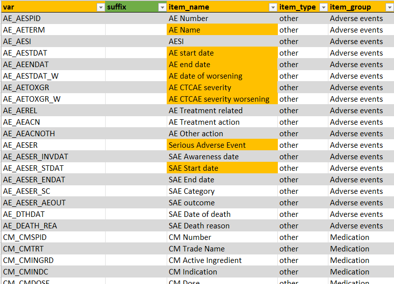

```{r, include = FALSE}
knitr::opts_chunk$set(
  collapse = TRUE,
  comment = "#>"
)
```

```{r setup, echo = FALSE}
library(clinsight)
```

A metadata file needs to be customized and created for each study. Use the function `create_clinsight_metadata()` to create and open a new template. The Excel template contains multiple tabs which are described below in detail. The orange tabs are mandatory and should not be removed or renamed.

{width="587" height="35"}

#### column_names

Within the first tab, the column names of the raw data need to be specified. The columns with the names within `name_raw` will be renamed to the new name when merging metadata with raw data later. Again, orange fields should not be adjusted.


#### events

Next tab contains information about study events.


All study visits should be entered in the `event_id` column, in order to preserve the correct order of events.

The green-colored column names are optional columns. `is_regular_visit` can be used to mark a specific visit as non-regular/ not planned. Unplanned visits will not show up in the compact timeline and will not be used to increment an internal visit counter for each patient.

If needed, the name of the `event_id` can be customized using two columns. `event_label_custom` changes the event label within the compact timeline in the top right corner of the application. `event_name_custom` will change the standard `event_id` label anywhere else in the application.

Lastly, ClinSight needs to know which is the baseline event to create internal counters of how many days are passed since baseline. It assumes that the first visit in the list (which is `SCR` in the example) is the baseline visit, but this can be changed using the `is_baseline_event` column. Note that only one event can be set as baseline here.

If the number of events cannot be specified correctly beforehand, a user can also provide an `event_id_pattern` matching to create event labels and event names.

#### common_forms

This tab contains information about the variables that need to be displayed in the `Common events` tab in `ClinSight`. Together with `study_forms` and `general`, this tab contains most of the data that will show up in the app. The column `var` contains the exact name of the variable in the raw data. The item_name column shows how it will show up in the application. For common forms, there are prefixes (AE, CM, MH) that will be stripped from the item_name; these are used to provide a unique name for each variable. The `item_group` tab is the exact name of the form that will show up in the application. Lastly, `item_type` can either be continuous or other, and it controls whether visualization or only tables will be displayed. This should usually be set to `other` within study_forms. More information on the other implemented options follows in the description for the `study_forms` below.

{width="633"}

Note that some of the `item_name`s are colored orange, meaning that ClinSight expect these names to be present. Currently it is not recommended to change these names. If they are missing in your own data, just leave them in the metadata as is. It will be made easier to customize these names and variables in a future update.

#### study_forms

This tab contains information about the variables in the `Study data` tab in ClinSight. Mandatory columns are here `var`, `item_name`, `item_type`, and `item_group`.


Data and forms/item_groups entered in the `study_forms` tab will either show up in table form or, if all variables within an `item_group` are of `item_type` 'continuous', in interactive graphs. If all data is 'continuous', units and limits can be provided directly if these do not change within each site.

If limits are provided in the data, and especially if they can vary per study site, then there is an option within ClinSight to scale the values for each analyte to a value between 0 and 1, with 0 being the lower limit and 1 being the upper limit of the normal range, based on the normal ranges of the local laboratory. The formula used for scaling is shown below:

$$x_{scaled} = \frac{x-x_{lower}}{x_{upper}-x_{lower}}$$ *(*$x^{lower}$ is the lower limit of x and $x^{upper}$ the upper limit, according to the site-specific laboratory ranges).

In order to use this functionality, the values `item_scale` and `use_unscaled_limits` in the tab [form_level_data](#form_level_data) should both be set to `FALSE`.

#### general

This tab contains information about variables that are needed in ClinSight, but do not necessarily need to be displayed in the `Common events` or `Study data` tab. Of note that here are also a view mandatory names that are still needed for ClinSight to function. It is not advised to delete these names. If they are missing in your own data, just leave them in the metadata as is.


#### form_level_data {#form_level_data}

This is an optional tab. If provided, the column `item_group` is mandatory. In this tab, settings can be adjusted on form level rather than setting them within the `common_forms` or `study_forms` tab.


If a form is missing here, or one of the values `item_scale`, `use_unscaled_limits`, or `review_required` is not provided, then the defaults will be used for that form:

| item_scale | use_unscaled_limits | review_required |
|------------|---------------------|-----------------|
| `NA`       | `NA`                | `TRUE`          |

#### table_names

Can be used to get nicer names in the interactive tables in ClinSight. Current table contains mostly standard ClinSight names, but also other variable names could be included here.


#### settings

Contains some miscellaneous settings, such as settings for providing custom functions when merging data with the `merge_meta_with_data()` function.
