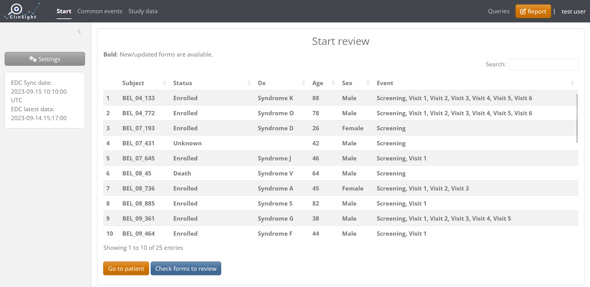

```{r, include = FALSE}
knitr::opts_chunk$set(
  collapse = TRUE,
  comment = "#>"
)
```

```{r setup, echo=FALSE}
library(clinsight)
```

To get started, you can easily run and test ClinSight by using the function `clinsight::test_clinsight()`. This function loads all data in a temporary folder that will be cleaned up after use. If no data is provided, "dummy" data will be used to run the application. Note that this function is only meant for testing and development, and is a wrapper around `clinsight::run_app()`, the primary function to launch the app. Executing `clinsight::run_app()` directly will create a database in the working directory that will record user actions such as the study data's review status. This database is required for deployment in a production environment.

```{r eval=FALSE}
# Not run:
# If evaluated, this will run ClinSight with internal test data
test_clinsight()
```

Once launched, the `Start` screen will look like the following:

{width="556"}

## Create custom data and metadata

In order to use custom study data with ClinSight, first the raw data needs to be in the correct format ([see below](#raw_data_structure)). Secondly, a ClinSight metadata file needs to be prepared so that the app knows how to use the raw data. (see `create_clinsight_metadata()` and `get_metadata()`. Then, the raw data needs to be merged with the metadata file (using merge_meta_with_data()) to create custom `ClinSight`-compatible input data. All details about the metadata template and how to customize it can be found in the `vignette("Metadata")`.

### Raw data structure {#raw_data_structure}

Raw study data is expected to be in 'long format' with all columns being of type `character`. Below is a table with the required columns. Note that the column names shown below are flexible since they can be customized (renamed) using the ['column_names' tab](./Metadata.html#column_names) from the metadata template as needed.

|                |                                                                                                                |
|-------------------|-----------------------------------------------------|
| **Name**       | **Description**                                                                                                |
| site_code      | Identifier for study site.                                                                                     |
| subject_id     | Unique identifier for a subject                                                                                |
| event_id       | Identifies events within a study, such as study visits.                                                        |
| event_date     | The date of the event. Should be convertible from a character vector to a valid date within R.                 |
| event_repeat   | Counter containing a sequence number that increments if an event_id is repeated within the same subject.       |
| form_id        | Identifier for each form. Can be mostly ignored, since new form identifiers are set within ClinSight metadata. |
| form_repeat    | Counter containing a sequence number that increments if a form is repeated within the same subject.            |
| var            | Name of the variable to use in ClinSight. Longer/more appropriate names will be specified in metadata.         |
| item_value     | Value of the variable (`var`) in question.                                                                     |
| edit_date_time | The time at which the value was last edited. Important for efficient reviewing of the data within ClinSight.   |

As an example, we will show raw data pre-installed with the package that can be converted to `ClinSight`-compatible input data.

```{r}
raw_data <- get_raw_csv_data(system.file("raw_data", package = "clinsight"))
head(raw_data)
```

### Merge and prepare data

When metadata in the Excel sheet is adjusted properly for study-specific needs (see `vignette("Metadata")`), it should be converted to an R object with the function `get_metadata()`:

```{r }
meta_custom <- get_metadata(system.file("metadata.xlsx", package = "clinsight"))
```

Next step in preparing data for ClinSight is merging the metadata object with the raw data using the function `merge_meta_with_data()`. This will output an informative error message if an incompatible change was made.

```{r}
merged_study_data <- merge_meta_with_data(raw_data, meta_custom)
```

Finally, we can test launch ClinSight with our custom data and metadata:

```{r, eval=FALSE}
#Not run
test_clinsight(merged_study_data, meta_custom)
```

Notice that the application shows a warning if some variables defined in the metadata are not available in the actual data, similar to the message below. It is useful to check this output carefully to see if any variable names were entered incorrectly.

```{r}
# Warning in check_appdata(app_data, meta) :
#   Not all variables defined in metadata are present in the data.
#              var               item_name
# 1 AE_AESER_AEOUT             SAE outcome
# 2     WHO_WHOCAT   WHO.subclassification
# 3       DMOD_DAT    DoseModificationDate
# 4      DMOD_REAS  DoseModificationReason
# 5      DMOD_DOSE DoseModificationNewDose
```

To iteratively improve the metadata, simply stop the application, adjust the metadata, merge it again with the raw data, and re-launch using `test_clinsight()`. For example, if we want to change the name of 'Systolic blood pressure' to 'SBP', we can adjust this in the Excel file, save the metadata and use `get_metadata()` again:


```{r eval=FALSE}
#Not run
adjusted_study_data <- merge_meta_with_data(raw_data, meta_custom_adjusted)
test_clinsight(adjusted_study_data, meta_custom) 
```

If changed correctly, the name of the variable will change accordingly in the application:

{width="621"}
